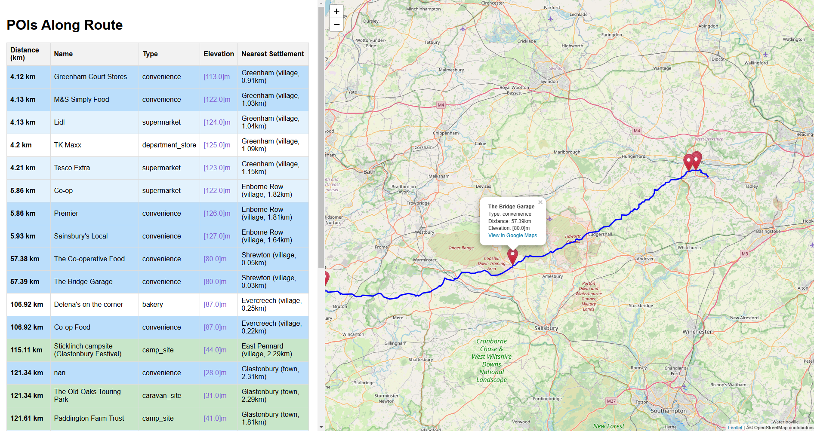

# RouteThink

A Python toolkit for analyzing GPX tracks and finding useful Points of Interest (POIs) along a route. Particularly useful for planning hiking, cycling, or road trips by identifying shops, campsites, and other amenities along your route.

## Main Features

- Interactive split-screen interface with POI list and route map
- Finds shops (supermarkets, convenience stores, etc.) and campsites along a GPX route
- Calculates distances along the route to each POI
- Provides elevation data for each location
- Identifies nearest settlements
- Click-to-zoom functionality for easy POI location
- Color-coded POI list for easy reference



## Installation

Install all required packages with:

```bash
pip install gpxpy osmnx geopandas shapely pandas requests folium
```

## Usage

The main script to use is `better_search_poi.py`. This is the most up-to-date version that directly searches for POIs along your route.

To use:

1. Place your GPX file in the same directory as the scripts
2. Edit `better_search_poi.py` and modify these variables in the `main()` function:
   ```python
   gpx_file = "gpx_test.gpx"  # Change to your GPX filename
   buffer_distance = 500       # Search distance in meters from route
   ```
3. Run the script:
   ```bash
   python better_search_poi.py
   ```

The script will generate:
- `route_pois.csv`: Spreadsheet containing all POIs
- `route_pois.html`: Interactive HTML report with map and POI list
- `debug_log.txt`: Detailed logging information

## File Description

- `better_search_poi.py`: Main script for finding POIs along a route (recommended)
- `gpx_functions.py`: Helper functions for GPX file handling and route processing
- `poi_functions.py`: Legacy POI search functions (kept for reference)

## Output Format

The HTML report features a split-screen layout:
- Left side: Color-coded POI list with:
  - Light blue: Supermarkets
  - Medium blue: Convenience stores
  - Darker blue: Other shops
  - Pastel green: Campsites
- Right side: Interactive map showing:
  - Full route trace in blue
  - Clickable POI markers
  - Zoom and pan controls

Each POI entry includes:
- Distance along route (km)
- Name and type of POI
- Elevation
- Nearest settlement
- Clickable coordinates linking to Google Maps

Click any POI in the list to zoom to its location on the map.